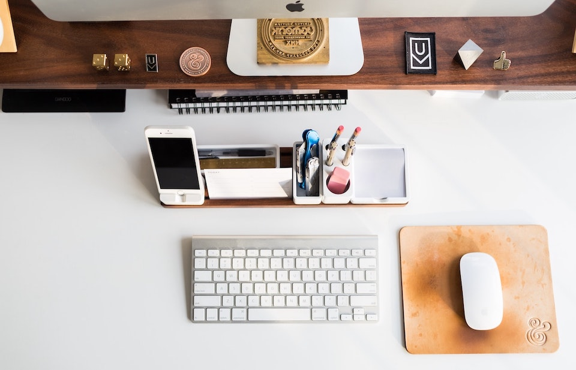
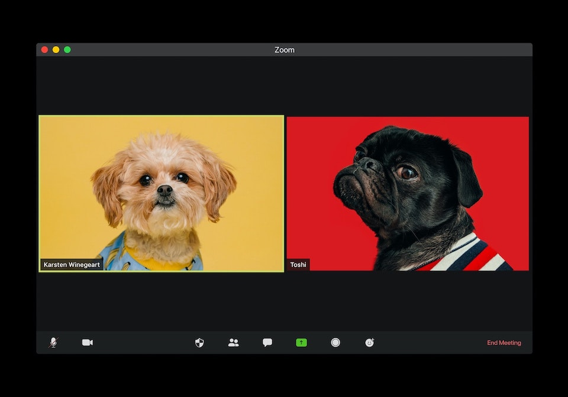
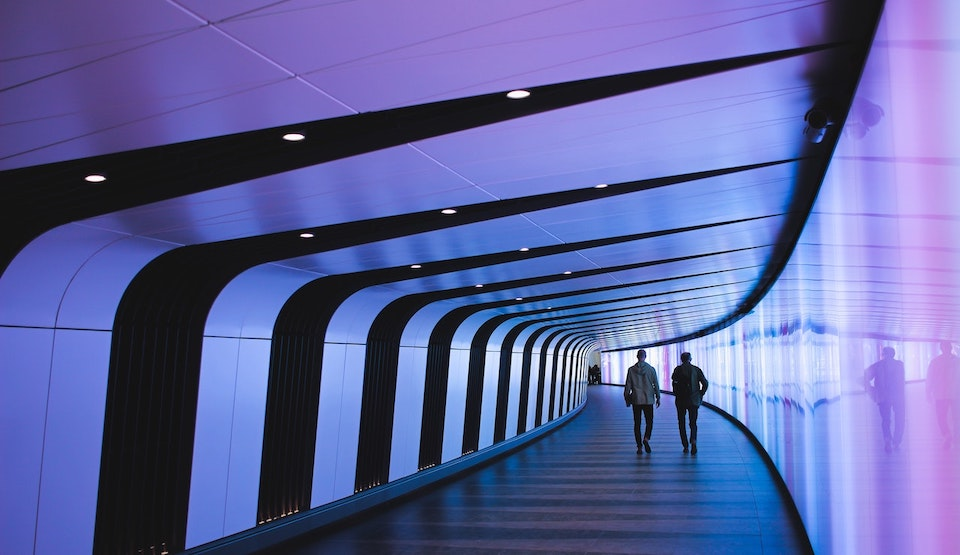

新冠肺炎的疫情在美國仍持續升溫中，截至 5/17 日為止，美國確診數已經突破 150 萬人，每天新增的確診數還是在兩萬到三萬之間。即使如此，愛好民主以及自由的美國人已經忍不住了，不斷給予政府壓力，各州政府都在研擬解封的條件、漸進式的解封、以及相關的配套措施。

科技公司也不例外，Google 以及 Facebook 紛紛宣布將漸進式地開放辦公室，同時大部分員工可以選擇在家工作到 2020 年底。Apple 跟 Tesla 的員工就沒這麼幸運了，畢竟這兩間公司的產品是以硬體為主，沒有意外的話他們會是最早重啟辦公室的科技巨頭。Tesla 的執行長馬斯克甚至直接不鳥加州政府的命令，已經重啓產線，並且揚言要告加州政府以及考慮將工廠搬離加州。

相較之下，Twitter 的員工想必是最幸運的了，幾天前 Twitter 發布了[新聞稿](https://blog.twitter.com/en_us/topics/company/2020/keeping-our-employees-and-partners-safe-during-coronavirus.html)，**如果你的職位允許，員工可以選擇永遠在家工作！**

> 如果我們員工的職位允許他們在家工作，而且他們也希望永遠如此的話，我們會成全這件事情。如果不行，當我們覺得復工是安全的，並且搭配額外的預防措施，辦公室將會是他們溫暖友好的地方。
>
> if our employees are in a role and situation that enables them to work from home and they want to continue to do so forever, we will make that happen. If not, our offices will be their warm and welcoming selves, with some additional precautions, when we feel it’s safe to return.

其中這段聲明更是霸氣：

> 開啟辦公室是我們的決定，什麼時候回來，或是要不要回來，是員工的決定。
>
> Opening offices will be our decision, when and if our employees come back, will be theirs.

## 如果可以，你會選擇永遠在家工作嗎？

## 在家工作兩個半月

Square 是第一批宣布在家工作的科技公司，早在 3/2 我們就強制所有人非必要不得來辦公室，算一算時間過得飛快，不知不覺已經過了兩個半月了呢。

在家工作最顯而易見的好處就是 —**你再也不用浪費時間通勤了**！灣區的交通真的很差，單程的通勤時間動不動就要四十分鐘到一個小時，不過我也因此養成了聽 Podcast 的好習慣。

在家工作以後，這些時間都省下來了，省下來的時間可以用來做什麼呢？你猜對了 —**用來做更多的工作**。這就是問題的所在，中間少了通勤作為緩衝，上班跟下班的界線反而變得模糊了。在公司大家開始抱怨生活品質變差，一起床就上班，然後常常下不了班，因為疫情的關係大家也無法請假出去玩。

好在公司很快地意識到了這點，在全員大會數次告訴員工：

> 現在這個時刻，你的身心健康是最重要的，要先照顧好自己才能照顧好其他人。如果放假可以讓你好好休息、充電，回來的時候更有效率，我們鼓勵你們這麼做。

這也不是說說而已，有個高管也以身作則，請了一星期的假 (即便現在哪都不能去)。我們的部門也宣布大家 5/25 放假，剛好連著美國國定假日一起，希望大家可以把握這四天假，好好休息。

因應在家工作，這段時間我也做了以下的調整：

* **建立上下班的儀式**：即使在家，我還是會換上上班的服裝，然後下班時換上比較輕鬆的服裝，告訴自己現在是下班時間。
* **設定一個辦公區域**：規劃一個辦公區域，有我所需要的螢幕、桌子、椅子等等，把這個地方佈置成適合工作而且有效率的地方。更重要的是，**只在這個地方工作**，盡量避免在沙發這類的地方工作，來區隔上下班的生活。
* **準備好所需的東西**：網路該升級就得升級，需要的器材該買就得買，比方說印表機、飲料、或是水，反正就是準備好工作會需要的東西。
* **該休息就得休息**：沒有人能預料到這波疫情會改變大家的工作型態，所以我們都還在學習如何在家工作，如果真的狀態不好、需要休息，那就休息吧！放自己一馬不要用力過猛。

## 遠距工作的挑戰

儘管遠距工作有許多好處：免通勤、彈性工時、不限制辦公地點等等，它同時也有了許多問題及挑戰，相關的制度跟配套措施也都是我們要去思考的。

### 視訊會議比想像中的還累人

在實體的互動，我們除了透過語言以外，很大一部份是靠著肢體動作來溝通的。透過對方的表情、手勢以及坐姿等等，我們可以得知很多隱藏的訊息，但是這一切在視訊會議中都沒有。矛盾的是，我們的大腦仍不斷地在畫面中尋找非語言的肢體訊號，但終究遍尋不著，導致視訊會議比實體會議還要累人。

最好的解決方法是：**避免所有非必要的視訊會議**。這聽起來很反直覺，在遠距工作的情況下，不是應該要有更多的溝通，甚至應該要過度溝通 (over-communicate) 才能夠確保團隊有一樣的認知嗎？是的，但視訊會議不是最好的方式，寫下來才是。

不管是透過 Email、Slack、Wiki或是設計文件，如果能夠用文字方式的溝通，就不需要透過視訊會議。用文字除了可以有多一分思考的機會以及讓未來的人參考以外，也可以讓跨時區的成員有一樣公平的機會參與。

### 多人視訊會議的缺點

儘管 Zoom 以及 Google Meet 這類的視訊軟體已日漸成熟，對於多人視訊的支援也比幾年前好上許多，但還是有許多的不方便。

我觀察到的最大問題是：**演講者缺乏回饋**，多數的軟體設計都是呈現大大的簡報畫面，其他人的頭像在側邊欄，人太多的話有些頭像還顯示不出來。這對於演講者要掌握聽眾理解程度，真的是一大挑戰。此外，大部分的聽眾預設是靜音的，這也降低了人們問問題或是給予即時回饋的意願。

另外，即使不是在有人簡報的會議，多人視訊會議還是有個很大的限制：**一次只能有一個對話**。更多時候是只能有一個人講話，我們沒有辦法像實體會議一樣，跟旁邊的人開啟悄悄話模式。

現階段我認為沒有太好的解法，只能等未來的某一天，全像投影技術可以用在視訊會議上的時候吧。

### 實體互動的不可取代性

不管我們再怎麼努力，科技還是有其限制性。增加遠距工作的效率，讓公司部門的 OKR 達標，這些都不是問題，但隔著螢幕終究還是少了那一味。跟同事說聲早安、吃午餐、喝個咖啡閒聊公司八卦的體驗，終究是無法被取代的。這些體驗乍看之下對工作效率沒有直接幫助，卻是決定員工歸屬感以及工作開心程度的重要指標，也會影響員工的留存率。

這也是為什麼即便是全世界最大的全遠距工作公司 — GitLab，每年也會舉辦一次實體聚會，將全世界的員工飛到同一個地方度假。目前 GitLab 擁有 1295 名員工，散佈在 67 個國家。

## 在家工作適合你嗎？

這個答案因人而異，目前也只有知識工作者有這個甜蜜的煩惱。如果你的工作性質是可以獨立運作，或是可以線上有效率地跟同事合作，並且你也對工作很上手，在家工作絕對可以考慮。你可以有更多的時間陪家人，做自己想做的事情，有彈性的工作時間以及地點，何樂而不為呢？

相反的，如果你在職涯剛開始的階段，在家工作反而會對你的學習效率大打折扣。另外對於沒有家庭或是一個人住的人，實體辦公室對於滿足社交需求也是很重要的。或者更重要的是，你搞不好根本不喜歡在家工作。

## 遠距工作的未來

這波疫情強迫全世界的人進行一場大型的在家工作實驗，有的人喜歡，但也有人恨不得辦公室早點開放。但是無論如何，遠距工作一定是未來的趨勢。在疫情結束之後，肯定有更多的公司以及個人開始擁抱這樣的工作模式。

改變也需要時間，我預測會先從複合式的模式開始，不會一開始就進入全遠距的模式。對於個人來說，可以從一週進辦公室一兩天開始，慢慢考慮是否要往全遠距發展；對於公司，會開始實驗遠距工作，並且考量效率以及成本，可以想見有些公司會關閉實體辦公室，而另外一些公司發現這行不通，重回辦公室的懷抱。

矽谷科技公司肯定會招募更多在矽谷以外的研發人才，當你的範圍是全世界，而且可以用更便宜的薪水招到更好的人，怎麼可能不這麼做呢？這樣的後果是矽谷會迎來出走潮，畢竟這裡的房價物價實在是太高了，如果你在其他生活品質更好的地方可以享有一樣的工作機會，為什麼還要待在這裡呢？

**你的選擇會是什麼？快留言告訴我們吧！**